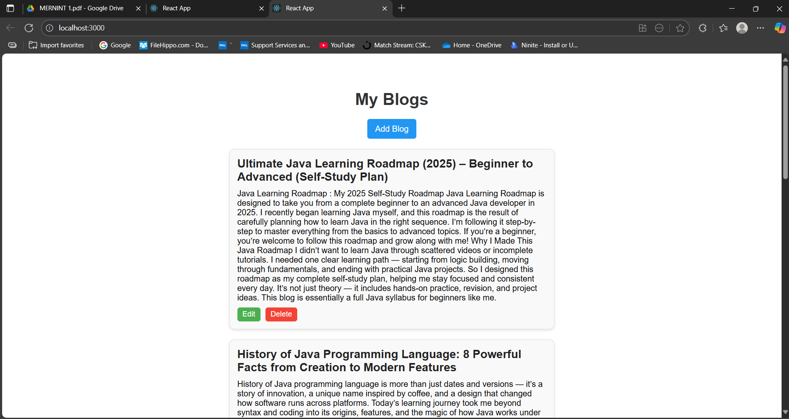
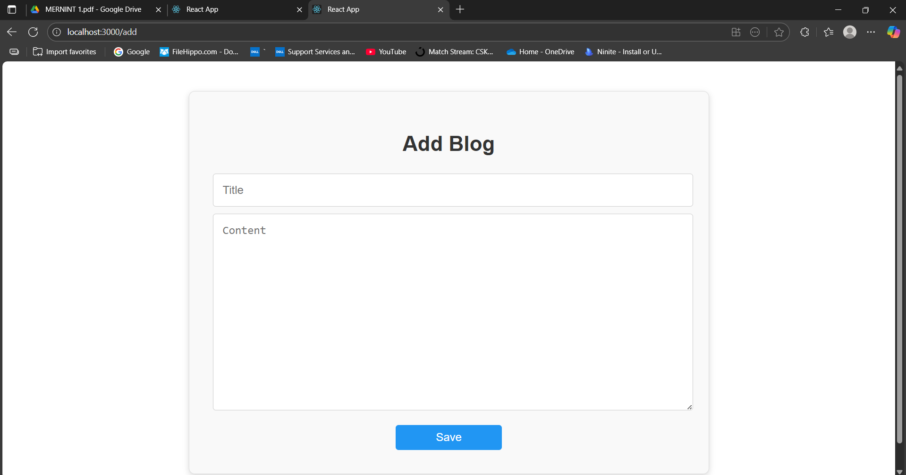
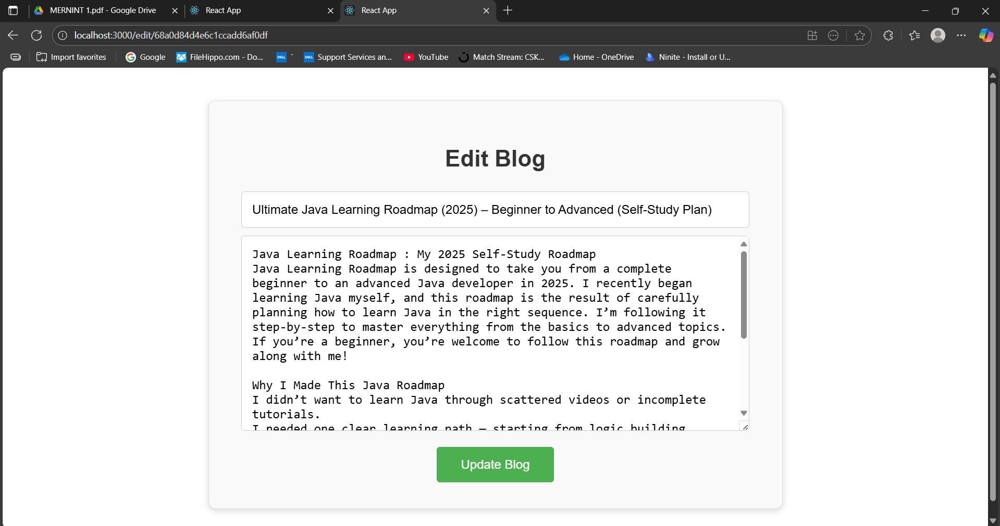

# MERN Blog Project

## Overview

The **MERN Blog Project** is a personal blog platform built using the **MERN stack (MongoDB, Express.js, React.js, Node.js)**.
It allows users to **add, view, edit, and delete blog posts**, offering a complete CRUD experience.
The project demonstrates full-stack integration: **Frontend (React) → Backend (Express + Node) → MongoDB Atlas**.

---

## Features

* Create new blog posts with **title, content, and author**.
* Display all blogs on the **Home page**.
* Edit and update existing blog posts.
* Delete blogs easily.
* Data is securely stored in **MongoDB Atlas**.
* Fully functional connection between frontend, backend, and database.

---

## Tools & Technologies Used

* **Frontend:** React.js, Axios, React Router
* **Backend:** Node.js, Express.js, Mongoose, CORS
* **Database:** MongoDB Atlas
* **Testing:** Postman for API testing
* **Code Editor:** VS Code
* **Version Control:** Git & GitHub

---

## Project Workflow

### Backend Development

1. Created a `backend` folder and initialized a Node.js project.
2. Installed required dependencies:

```bash
npm install express mongoose cors nodemon
```

3. Set up `server.js` with:

   * Express server configuration
   * MongoDB connection using Mongoose
   * Simple test GET route to verify server running

4. Added a start script in `package.json`:

```json
"scripts": {
  "start": "nodemon server.js"
}
```

5. Tested backend endpoints using **Postman** to ensure CRUD operations worked correctly.

---

### Frontend Development

1. Created a React app inside the `frontend` folder:

```bash
npx create-react-app frontend
```

2. Installed necessary dependencies:

```bash
npm install axios react-router-dom
```

3. Created **pages**:

   * `Home.js` → Displays all blog posts
   * `AddBlog.js` → Form to add a new blog post
   * `EditBlog.js` → Form to edit an existing blog post

4. Created **components**:

   * `BlogList.js` → Renders blog posts with edit/delete functionality

5. Integrated frontend with backend using **Axios** for API calls.

---

### Database Setup

* Created a **MongoDB Atlas** account, cluster, and database.
* Created a `Blog` collection to store all blog entries.
* Connected backend to MongoDB using the connection string in `server.js`.

---

### CRUD Implementation

* **Add Blog:** POST request from `AddBlog.js` to backend.
* **View Blogs:** GET request in `Home.js` to fetch all blogs.
* **Edit Blog:** PUT request from `EditBlog.js` to update a blog.
* **Delete Blog:** DELETE request from `BlogList.js`.

All actions are reflected instantly on the frontend and stored in MongoDB.

---

### Screenshots

#### Home Page

Displays all blog posts with options to edit and delete.



---

#### Add Blog Page

Form to create a new blog post with title, content.



---

#### Edit Blog Page

Form to update existing blog posts.



---

## Outcome

* Fully working **MERN Blog Platform**.
* Users can **add, view, edit, and delete blogs** seamlessly.
* Demonstrated **end-to-end integration** of frontend, backend, and database.
* Successfully tested APIs with **Postman** and frontend interactions in the browser.

---

